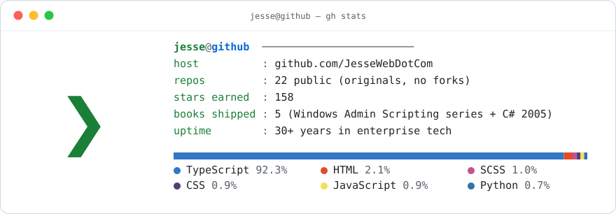

<div align="center">



<br/>

[](https://www.linkedin.com/in/jessemtorres/)

</div>

I help organizations improve end-user productivity by **designing, securing, and operationalizing enterprise technology** — end-user computing, infrastructure engineering, automation, DevOps, cyber security, endpoint management, and modern **AI enablement**. 30+ years across military, government, financial, and corporate environments, including work requiring Top Secret clearance.

These days my focus is **enterprise AI**: evaluating, integrating, governing, and hardening platforms like **Claude, Claude Code, ChatGPT Enterprise, MCP integrations, and agent architectures** for production use in security-conscious organizations.

<br/>

## `$ git log --oneline career/`

```text
* 2024─  feat(ai):     enterprise AI enablement — Claude, MCP, agents, governance & hardening
* 2019─  feat(cloud):  Azure Virtual Desktop architecture, automation & operations
* 2005   docs:         publish "Windows Admin Programming with Visual C# 2005"
* 2001─  feat(core):   join Bridgewater Associates — platform engineering, DevOps, EUC
* 2000   docs:         publish "Windows 2000 Admin Scripting"
* 1999   feat(sec):    Sikorsky Comanche program — security, imaging & automation at scale
* 1998   feat(ent):    PricewaterhouseCoopers — enterprise support through the '98 merger
* 1992   init:         Air National Guard — computer maintenance & cryptography (TS clearance)
```

<br/>

## `$ ls ~/projects`

| project | description |
| :-- | :-- |
| 🚗 [**homepage-for-tesla**](https://github.com/JesseWebDotCom/homepage-for-tesla) | Self-hosted personal homepage for your Tesla's browser, with auto light-dimming |
| 🏠 [**home-assistant-configuration**](https://github.com/JesseWebDotCom/home-assistant-configuration) | My complete personal home-automation solution built on Home Assistant |
| 🌳 [**webtrees-theme-modern**](https://github.com/JesseWebDotCom/webtrees-theme-modern) | A modern, mobile-optimized theme for the webtrees genealogy platform |
| 🍎 [**macos-setup-scripts**](https://github.com/JesseWebDotCom/macos-setup-scripts) | Zero-touch configuration, optimization, and app install for a fresh macOS build |
| 📦 [**vscode-dev-container**](https://github.com/JesseWebDotCom/vscode-dev-container) | Fully pre-configured, isolated VS Code dev environment for any language |
| 🤖 [**loki-doki**](https://github.com/JesseWebDotCom/loki-doki) | Your family. Your data. Your rules. A private, self-hosted AI platform for the whole home |

<br/>

## `$ man jesse | grep -A6 PUBLICATIONS`

> **PUBLICATIONS** — before "infrastructure as code" had a name, I was writing the manuals for it.

- 📕 **Windows Admin Scripting** — *1st, 2nd & 3rd editions*
- 📗 **Windows 2000 Admin Scripting**
- 📘 **Windows Admin Programming with Visual C# 2005**
- 🤖 *Technical editor:* **Robot Building for Dummies**

<br/>

## `$ which tools`

**AI & agents**


**Platforms & EUC**


**Automation & DevOps**


**Home lab**


<br/>

## `$ tail -n 5 activity.log`

<!--ACTIVITY:START-->
```text
2026-07-12  commit  jesseweb-com  Title screen lists the fire keys
2026-07-12  commit  jesseweb-com  Mobile control polish, landscape front page, retitle, quiet reader text
2026-07-12  commit  jesseweb-com  Author mini-game, PWC tower, fullscreen landscape, reader mode
2026-07-12  commit  jesseweb-com  Mobile gamepad overlay + complete pop-culture ad names
2026-07-12  commit  jesseweb-com  Two machines: front page, TV at /tv/, and Torres Quest at /game/
```
<!--ACTIVITY:END-->

<br/>

## `$ gh stats`

<div align="center">

<picture>
  <source media="(prefers-color-scheme: dark)" srcset="assets/stats-dark.svg">
  
</picture>

<sub>*no third-party stat services — this card is generated daily by a GitHub Action in this repo*</sub>

</div>

<br/>

<div align="center">

`exit 0` &nbsp;·&nbsp; *automating the enterprise since before it was cool* &nbsp;·&nbsp; [**let's connect →**](https://www.linkedin.com/in/jessemtorres/)

</div>
